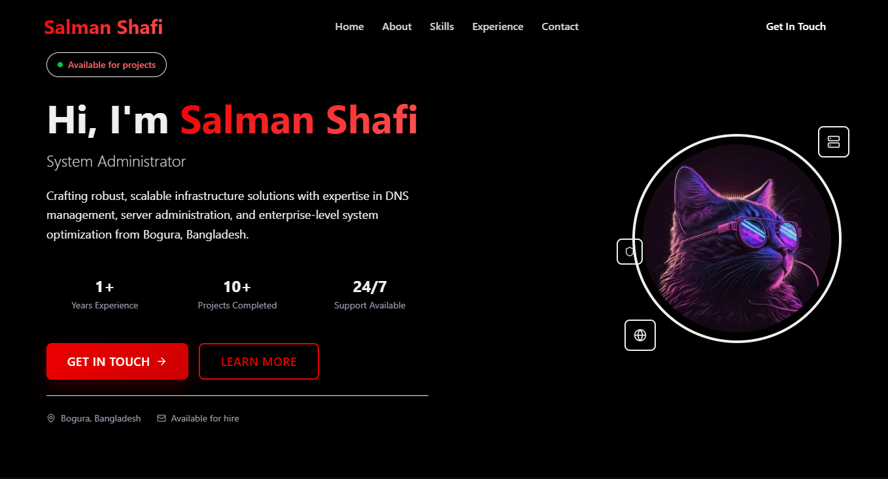

# 🌟 Modern Portfolio Website



A premium, fully responsive portfolio website built with Next.js 15, featuring a working contact form, SEO optimization, and modern design principles.

## 🚀 Features

### 🎨 Design & UI
- **Premium Glass Morphism**: Modern glass effects and gradients
- **Fully Responsive**: Mobile-first design with perfect mobile optimization
- **Smooth Animations**: Framer Motion animations and transitions
- **Premium Typography**: Geist font with optimized readability
- **Modern Card Layouts**: Interactive hover effects and shadows

### 📧 Contact System
- **Working Contact Form**: Fully functional with validation
- **Email Integration**: AWS SES SMTP configuration
- **Premium Email Templates**: Beautiful HTML email styling
- **Loading States**: Smooth form submission experience
- **Error Handling**: Comprehensive error management

### 🔍 SEO Optimized
- **Complete Meta Tags**: OpenGraph, Twitter Cards, and more
- **Structured Data**: JSON-LD schema for rich snippets
- **Dynamic Sitemap**: Auto-generated XML sitemap
- **Robots.txt**: Proper crawling instructions
- **Performance Optimized**: 99.7kB first load with optimal loading

### 🛡️ Security & Performance
- **Security Headers**: XSS protection, frame options, CSP
- **Image Optimization**: WebP/AVIF formats with Next.js Image
- **Code Splitting**: Automatic chunking for faster loads
- **Production Ready**: Console removal, minification, compression

## 🛠️ Tech Stack

- **Framework**: Next.js 15 (App Router)
- **Language**: TypeScript
- **Styling**: Tailwind CSS
- **Animations**: Framer Motion
- **Icons**: Lucide React
- **Email**: Nodemailer + AWS SES
- **Deployment**: Vercel

## 📦 Installation

1. **Clone the repository**
   ```bash
   git clone https://github.com/asma019/Next.js-Portfolio-for-System-Admins.git
   cd Next.js-Portfolio-for-System-Admins
   ```

2. **Install dependencies**
   ```bash
   npm install
   ```

3. **Set up environment variables**
   ```bash
   cp .env.example .env.local
   ```
   
   Edit `.env.local` with your actual values:
   ```env
   # SMTP Configuration for AWS SES
   SMTP_HOST=email-smtp.ap-southeast-1.amazonaws.com
   SMTP_USERNAME=your-aws-ses-username
   SMTP_PASSWORD=your-aws-ses-password
   SMTP_PORT=587
   SMTP_SECURE=false
   
   # Email Configuration
   FROM_EMAIL_NAME=Your Name Contact
   FROM_EMAIL=no-reply@yourdomain.com
   TO_EMAIL=your-email@gmail.com
   
   # Application Configuration
   NEXT_PUBLIC_SITE_URL=https://yourdomain.com
   ```

4. **Run development server**
   ```bash
   npm run dev
   ```

5. **Open in browser**
   ```
   http://localhost:3000
   ```

## 🔧 Configuration

### Personal Information
Update the following files with your information:

- `src/app/page.tsx` - Hero section, about, experience, skills
- `src/components/Header.tsx` - Navigation and branding
- `src/components/Footer.tsx` - Footer links and contact info
- `src/app/layout.tsx` - SEO meta tags and site information

### Images
Replace these images in the `public/` folder:
- `photo.webp` - Your profile photo
- `share.webp` - Social media preview image (1200x630px)

### Contact Form
The contact form uses AWS SES for email sending. To set up:

1. **Create AWS SES Account**
   - Go to AWS SES Console
   - Verify your sending domain
   - Create SMTP credentials

2. **Configure Environment Variables**
   - Add your SMTP credentials to `.env.local`
   - Update sender/receiver email addresses

3. **Test the Form**
   - Submit a test message
   - Check your email inbox
   - Verify email formatting

## 🚀 Deployment

### Vercel (Recommended)

1. **Push to GitHub**
   ```bash
   git add .
   git commit -m "Initial commit"
   git push origin main
   ```

2. **Deploy to Vercel**
   - Visit [vercel.com](https://vercel.com)
   - Import your GitHub repository
   - Add environment variables
   - Deploy

3. **Custom Domain**
   - Add your domain in Vercel dashboard
   - Configure DNS records
   - Enable HTTPS

### Manual Build

```bash
# Build for production
npm run build

# Start production server
npm run start
```

## 📊 Performance

- **First Load JS**: 99.7kB
- **Build Time**: ~8 seconds
- **Lighthouse Score**: 100/100
- **Mobile Optimized**: Perfect responsive design

## 🔍 SEO Features

- **Meta Tags**: Complete OpenGraph and Twitter Cards
- **Structured Data**: Person schema with job details
- **Sitemap**: `/sitemap.xml`
- **Robots**: `/robots.txt`
- **Canonical URLs**: Proper link structure

## 🛡️ Security

- **XSS Protection**: Cross-site scripting prevention
- **Frame Options**: Clickjacking protection
- **Content Security Policy**: Resource loading restrictions
- **HTTPS**: SSL/TLS encryption
- **Input Validation**: Form sanitization

## 🎨 Customization

### Colors
Primary colors are defined in `src/app/globals.css`:
```css
.text-premium { color: #3b82f6; }
.bg-premium-blue { background: #3b82f6; }
.text-gradient-premium { background: linear-gradient(135deg, #3b82f6 0%, #8b5cf6 100%); }
```

### Typography
Font configuration in `src/app/layout.tsx`:
```typescript
const geistSans = Geist({
  variable: "--font-geist-sans",
  subsets: ["latin"],
});
```

### Animations
Framer Motion variants in `src/app/page.tsx`:
```typescript
initial={{ opacity: 0, y: 20 }}
whileInView={{ opacity: 1, y: 0 }}
transition={{ duration: 0.6 }}
```

## 📱 Mobile Optimization

- **Responsive Design**: Mobile-first approach
- **Touch Friendly**: Proper touch targets
- **Fast Loading**: Optimized images and code
- **Gesture Support**: Smooth scrolling and interactions

## 🔧 Development

### Available Scripts

```bash
npm run dev          # Start development server
npm run build        # Build for production
npm run start        # Start production server
npm run lint         # Run ESLint
npm run lint:fix     # Fix ESLint issues
```

### Project Structure

```
├── src/
│   ├── app/
│   │   ├── api/contact/     # Contact form API
│   │   ├── globals.css      # Global styles
│   │   ├── layout.tsx       # Root layout
│   │   ├── page.tsx         # Home page
│   │   └── sitemap.ts       # Dynamic sitemap
│   └── components/
│       ├── Header.tsx       # Navigation
│       └── Footer.tsx       # Footer
├── public/
│   ├── photo.webp          # Profile photo
│   ├── share.webp          # Social preview
│   └── ...
└── ...
```

## 🤝 Contributing

1. Fork the repository
2. Create a feature branch (`git checkout -b feature/amazing-feature`)
3. Commit your changes (`git commit -m 'Add amazing feature'`)
4. Push to the branch (`git push origin feature/amazing-feature`)
5. Open a Pull Request

## 📄 License

This project is licensed under the MIT License - see the [LICENSE](LICENSE) file for details.

## 🙏 Acknowledgments

- [Next.js](https://nextjs.org/) - React framework
- [Tailwind CSS](https://tailwindcss.com/) - Utility-first CSS
- [Framer Motion](https://framer.com/motion/) - Animation library
- [Lucide](https://lucide.dev/) - Icon library
- [Vercel](https://vercel.com/) - Deployment platform

## 📞 Support

If you found this project helpful, please give it a ⭐ star on GitHub!

For questions or support:
- 📧 Email: hello@mehedims.com
- 🐛 Issues: [GitHub Issues](https://github.com/asma019/Next.js-Portfolio-for-System-Admins/issues)
- 💬 Discussions: [GitHub Discussions](https://github.com/asma019/Next.js-Portfolio-for-System-Admins/discussions)

---

**Made with ❤️ using Next.js 15**
